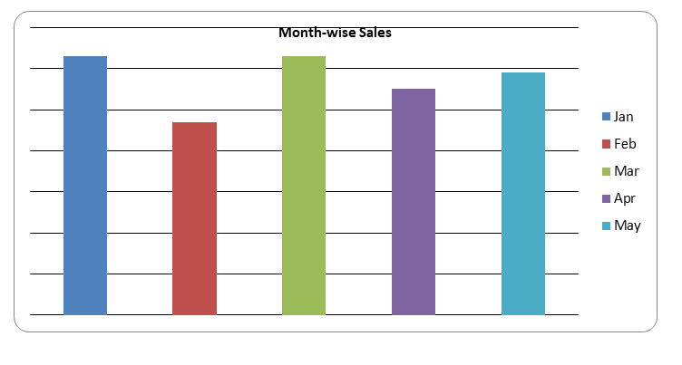
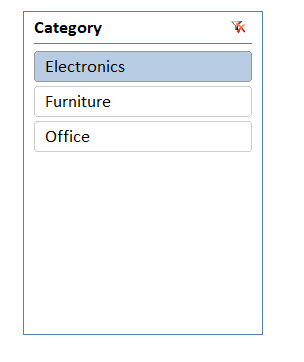

# Sales Dashboard (Excel Project)

## 📊 Objective
To analyze sales data based on product categories and monthly trends.

## 🛠 Tools Used
- Microsoft Excel
- Pivot Tables
- Slicers
- Charts

## 📈 Features
- Interactive dashboard
- Category-wise filtering using slicers
- Month-wise sales analysis

## 📷 Dashboard Preview

## 💡 Key Insights
- Identified top-performing categories
- Observed monthly sales trends
- Enabled easy data filtering for decision-making

